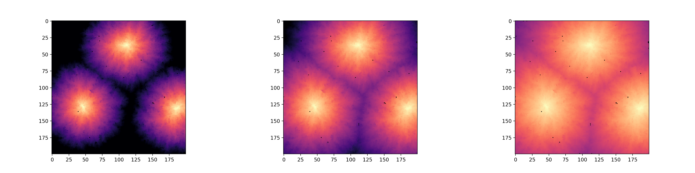
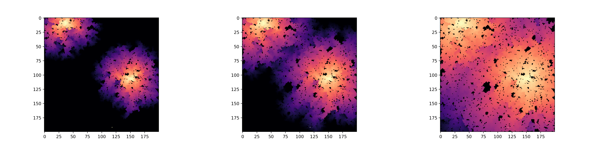

# Disease Simulations

A repo for testing out theoretical bounds on the spread of diseases on lattices and in contact networks.

Transmissibility 0.3, Recovery 0.1, Initially Infected 3

Transmissibility 0.6, Recovery 0.2, Initially Infected 3

